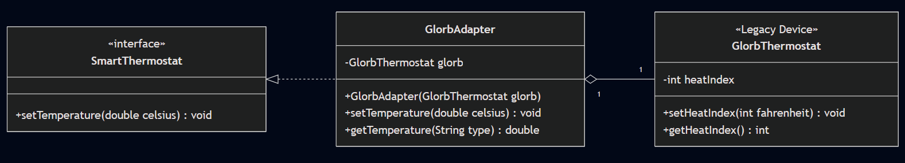

# OmniHome - Universal Smart Home Hub

---

## [Unit Tests Location](https://github.com/Emillock/ada-software-design-patterns-csci4731-s26/tree/main/src/test/java/module03/asg01)

---

## Design Patterns Used

| Pattern              | Module                                                             |
|----------------------|--------------------------------------------------------------------|
| **Singleton**        | `CloudConnection` - one global cloud connection                    |
| **Abstract Factory** | `DeviceFactory` - Budget and Luxury device families                |
| **Adapter**          | `GlorbAdapter` - bridges legacy hardware to the modern interface   |
| **Builder**          | `RoutineBuilder` - constructs complex automation routines fluently |
| **Prototype**        | `Configuration` - clone device configs without tedious re-entry    |

---

## Project Structure

```
src/
├── main/java/module03/asg01/
│   │
│   ├── builders/
│   │   └── RoutineBuilder.java # Builder for AutomationRoutine
│   │
│   ├── connections/
│   │   └── CloudConnection.java # Thread-safe Singleton cloud connection
│   │
│   ├── factories/ # Factories for creation of products
│   │   ├── DeviceFactory.java
│   │   ├── BudgetFactory.java
│   │   └── LuxuryFactory.java
│   │
│   ├── products/
│   │   ├── abstracts/ # Abstract products
│   │   │   ├── SmartLight.java 
│   │   │   ├── SmartLock.java
│   │   │   └── SmartThermostat.java
│   │   │
│   │   ├── automations/
│   │   │   └── AutomationRoutine.java # Built by RoutineBuilder
│   │   │
│   │   ├── concretes/
│   │   │   └── SmartDevice.java # Concrete device implementations
│   │   │
│   │   └── configurations/
│   │       └── Configuration.java # Cloneable device config
│   │
│   ├── legacy/
│   │   └── GlorbThermostat.java # Adaptee — old 90s device (Fahrenheit, integers)
│   │
│   └── Main.java # Demo
│
└── test/java/module03/asg01/ # JUnit tests
    ├── AdapterTest.java
    ├── BuilderTest.java
    ├── CloudConnectionTest.java
    ├── FactoryTest.java
    └── PrototypeTest.java
```

---

## UML Diagram



| Relationship                                    | Meaning                                                  |
|-------------------------------------------------|----------------------------------------------------------|
| `GlorbAdapter` **implements** `SmartThermostat` | Satisfies the interface the system expects               |
| `GlorbAdapter` **has a** `GlorbThermostat`      | Holds a private reference; delegates all real work to it |
